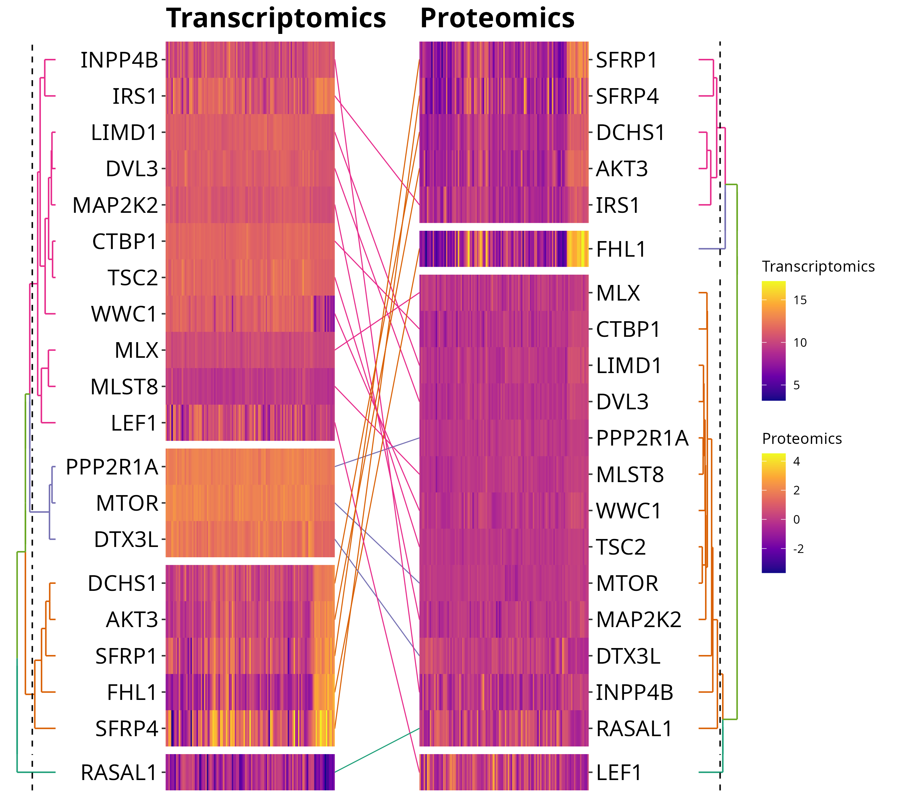

# ggalign: Bridging the Grammar of Graphics and Biological Multilayered Complexity

This repository provides all the code and data used to generate the figures in
the manuscript` ggalign: Bridging the Grammar of Graphics and Biological
Multilayered Complexity`. Each figure is supported by a dedicated Quarto
(`.qmd`) file and an associated data folder to ensure full transparency and
reproducibility.

All output files can be found in the `output/` directory. 

## Installation

The figures in this repository were generated using the development version of
[ggalign](https://github.com/Yunuuuu/ggalign). You can install it from GitHub as
follows:

``` r
# install.packages("remotes")
remotes::install_github("Yunuuuu/ggalign")
```

A CRAN release will follow once the next version of `ggplot2` is available
(see <https://github.com/tidyverse/ggplot2/issues/6565> for the progress).


## Note
The repository structure is illustrated in the figure below:

> ⚠️ ⚠️ ⚠️ ⚠️ The originally uploaded `Figure S2.pdf` was incorrect and cannot be
> replaced during peer review.
> Below we display the **correct version** of `Figure S2` for reviewer reference.  
> This updated figure accurately reflects the results described in the
> manuscript and will be uploaded to the official record when possible.



## Script Structure
All scripts have been organized and renamed to match their corresponding figure
numbers in the manuscript. Each `.qmd` file contains the full analysis pipeline
used to generate that specific figure, including preprocessing, visualization,
and optional statistical analysis.

For example:

`Figure 3.qmd` contains the script used to generate `Figure 3`, along with the
necessary data processing steps.

`Figure 6.qmd` contains the script used to generate `Figure 6`

These files are written in Quarto format to allow seamless rendering into HTML
or PDF, and can also be opened as plain R scripts for interactive use.


## Data Organization
Each figure has a corresponding folder (e.g., `Figure3/`, `Figure6/`) that contains
the raw and processed data used in the analysis:

Raw datasets (when permissible by license and size constraints) are included
directly.

For large or publicly hosted datasets (e.g., from GEO or SRA), download
instructions are provided inside the respective `.qmd` file.

Intermediate and processed results are saved to support step-wise execution and
partial reruns.

>Note: Some files may be too large to upload directly to the repository. In such cases, clear instructions and download links are provided to retrieve the required data manually.
